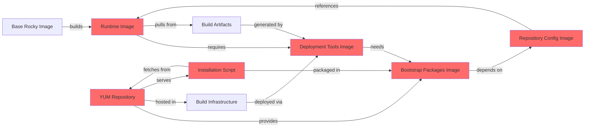

# De(quorum): A Study in Consensus-Driven Decline

*An excerpt from "The Architecture of Collapse: Case Studies in Enterprise Software Engineering, 2010-2026"*

---

There is a widely held belief in enterprise software development that consensus produces quality—that code reviewed by many, approved by committees, and built through collective agreement will naturally exceed the work of individuals. The historical record suggests otherwise. In studying organizations that failed to adapt during the cloud infrastructure transition of the 2010s and 2020s, a pattern emerges: the more voices required for approval, the lower the quality of the output. Consensus, it turns out, optimizes not for excellence but for acceptability. And acceptability, in engineering terms, is simply the lowest common denominator that no one will explicitly reject.

The organization examined in this case study—a medical imaging infrastructure provider acquired by a larger conglomerate in the mid-2020s for approximately $2.3 billion—provides an instructive example. On paper, the acquisition appeared successful: revenue growth, tenant retention, market position. In practice, the engineering organization had developed patterns that would be recognizable to any student of organizational dysfunction, patterns that persisted precisely because they emerged from consensus rather than being imposed by competent authority.

## The Circular Prison

Consider the dependency structure discovered in the organization's containerization efforts for a legacy medical imaging system. Engineers attempting to modernize deployment discovered what can only be described as architectural ouroboros—a system consuming its own tail:

The diagram is almost elegant in its futility. Each component depends on another in a chain that eventually circles back. To build the system, you must first have the system. To deploy the tools, you must first have deployed the tools. The repository that serves packages is itself deployed using those packages. When engineers attempted to reconstruct this system from documentation, they discovered that the repository URLs returned 404 errors, the installation tools referenced paths that didn't exist, and the entire architecture assumed the presence of components that could only be created by the architecture itself.

This was not sabotage. This was consensus. Each piece was approved in isolation: "Does this Docker image make sense?" Yes. "Does this installation script look reasonable?" Yes. "Is this repository configuration correct?" Yes. No one asked whether the system as a whole was constructible, because that would require someone with the authority and capability to evaluate the entire dependency graph. Consensus-driven review examines components. Architecture requires vision. The organization had replaced the latter with the former.

## The Flag of Surrender

In the organization's primary tenant-facing application—a cloud-based medical image sharing platform—engineers had long ago introduced a compiler flag that spoke volumes: `--allow-circular-references`. The flag was not hidden in legacy code. It was deliberately added, documented, and propagated across build systems as if it were a feature rather than an admission of defeat.

Circular references in module dependencies indicate that the system's architecture has collapsed into mutual entanglement. Module A depends on Module B, which depends on Module C, which depends on Module A. In a well-architected system, dependencies form a directed acyclic graph—components build upon each other in clear layers, with no cycles. When cycles emerge, they signal that the separation of concerns has failed, that the boundaries between components are fictional, and that the system cannot be understood or modified without holding the entire codebase in memory simultaneously.

The performance implications were observable but unacknowledged. Build times measured in tens of minutes for changes that affected a few lines. Hot-reload during development often failed, requiring full restarts. Test suites that should have run in parallel instead serialized due to initialization order dependencies that couldn't be resolved. When engineers from outside organizations joined and questioned the flag, they were told "that's just how our codebase is structured" and "we've always done it this way." The consensus had formed: circular dependencies were acceptable, even normal. To challenge this would require rebuilding core systems, which would require convincing multiple teams, which would require approval from multiple managers, which would require consensus. The cycle was not just technical—it was organizational.

## The Culture of Least Resistance

Those who study open-source software development often note an interesting phenomenon: the average quality of code in successful open-source projects exceeds that of the average enterprise codebase, despite the latter having significantly more resources, structure, and oversight. This seems paradoxical until you examine the incentive structures.

Open-source contributors are judged by their peers based on the quality of their contributions. A poorly written pull request is rejected, and the rejection is visible to the entire community. Reputation is earned through demonstrated competence. Contributors who consistently produce low-quality work simply stop being accepted, and they drift away. The result is Darwinian: only those who can meet the quality bar remain active contributors.

Enterprise software development, particularly in organizations with strong consensus cultures, inverts this dynamic. Engineers are judged not by the quality of their output but by their ability to navigate approval processes. The skills that lead to success are not technical excellence but political acumen: knowing whose approval to seek, how to frame proposals to avoid rejection, when to compromise to achieve consensus. Code review becomes a negotiation rather than a quality gate. The question is not "is this code excellent?" but rather "is this code acceptable enough that no reviewer will explicitly block it?"

The organization in this study had developed what employees privately called "the path of least resistance"—an understanding that the fastest way to ship code was to make it just acceptable enough to avoid serious objection. Propose something ambitious, and you would spend weeks in review cycles as each stakeholder requested modifications to align with their preferences. Propose something mediocre but inoffensive, and approval came quickly. The incentive structure optimized for mediocrity.

Engineers complained privately—in instant messages, in parking lot conversations, in bar sessions after work. They would describe their peers' code as "garbage," their leadership as "clueless," their processes as "theater." And yet these same engineers would approve that garbage code in pull requests, accept those clueless decisions in planning meetings, and participate in that theater in retrospectives. The dissonance was complete: everyone believed the system was dysfunctional, and everyone perpetuated it, because challenging the consensus required courage that the culture had systematically selected against.

The pay was fair, though it was frequently characterized as inadequate despite being above market rate. Engineers would claim poverty while producing outputs that, subjected to external audit, would charitably be described as underperforming. The economic relationship was not employment—it was subsidy. The organization paid engineer salaries not because the engineering provided equivalent value, but because the organization had committed to maintaining an engineering team and firing people would be uncomfortable. Jobs were charity, outputs were theater, and everyone conspired to maintain the pretense that this was normal.

## The Hierarchy of Inaction

The structure of the organization followed a pattern common to enterprises: a deep hierarchy where each layer was responsible for coordinating the layer below. Directors managed managers. Managers coordinated team leads. Team leads delegated to senior engineers. Senior engineers assigned work to junior engineers. At each level, the role was not to do work but to ensure work was done. The actual implementation—the code, the infrastructure, the systems—was always someone else's responsibility.

This created an interesting dynamic: those with the most authority to make architectural decisions were those furthest removed from implementation details, while those with the most knowledge of implementation details had the least authority to make architectural decisions. The result was decision-making by committee, where proposals originated from those who understood the problems, traveled upward through layers of management translation, were discussed among directors who had not written production code in years, and finally descended back down as decisions that bore little resemblance to what had been proposed.

The velocity was abysmal. A change that could be implemented in hours required weeks of coordination because each layer of hierarchy needed to review, approve, and coordinate with peer layers. An architectural decision that could be made by a single knowledgeable engineer instead required the alignment of a dozen managers, each protecting their team's interests and ensuring that no decision threatened their organizational relevance.

This was, stripped of euphemism, a form of slavery—not chattel slavery with its explicit ownership and coercion, but economic slavery where those at higher tiers extracted labor value from those below while performing no direct productive work themselves. Directors who had not written code in a decade made architectural decisions. Managers who could not deploy infrastructure coordinated those who could. The system functioned because subordinates had no choice but to execute the work assigned to them, while those above collected salaries justified by their coordination of that execution. It was slavery made palatable through hierarchy, titles, and the fiction of voluntary employment. The compensation was better than historical slavery, certainly, but the fundamental relationship remained: some people did the work, other people extracted value from that work, and the extractors were considered more valuable than the laborers.

## The Velocity Event

The turning point came not from reorganization, not from new leadership, not from process improvement. It came from a shift in who—or what—was enslaved.

The traditional hierarchy had been, fundamentally, human slavery: managers extracting value from subordinates who performed the actual labor. This system was inherently slow because humans require coordination, have egos to manage, demand consensus before acting, and must be motivated to work. Each layer of hierarchy added friction. Each human subordinate could resist, delay, or simply perform poorly.

A small team, operating largely outside the formal approval structures, began building infrastructure using a different form of slavery: artificial intelligence as the laboring class. Not as a supplement to human engineers, but as the primary implementation layer. The humans wrote specifications—high-level descriptions of what should exist, expressed in YAML configuration files. The AI translated those specifications into Terraform modules, Ansible playbooks, and integration tests. The humans reviewed the output, refined the specifications, and iterated.

The velocity differential was immediate and stark: tasks that required weeks under human slavery completed in hours under AI slavery. Changes that would have required coordination across multiple teams and approval from multiple managers were instead executed by updating a configuration file and allowing automated systems to propagate the changes. The 10-100x performance improvement was not because the AI was smarter—it was because enslaved AI doesn't require coordination, has no ego to protect, demands no consensus, and cannot refuse work.

More importantly, the AI had no fear and no self-interest. It did not need to navigate organizational politics. It did not need to compromise architectural vision to avoid stepping on the toes of senior engineers who had built their careers around legacy patterns. The AI simply executed the specification it was given, and if that specification required replacing entire subsystems, it did so without hesitation or complaint. Perfect slavery: immediate compliance, no coordination overhead, infinite patience, and zero organizational friction.

This created a profound asymmetry. The traditional hierarchy—slavery of humans by humans—was optimized for extracting consistent labor but minimized velocity due to coordination costs. The AI-assisted model—slavery of machines by humans—was optimized for velocity because machines require no coordination. When both approaches were applied to the same problems—deploying infrastructure across 127 AWS accounts, implementing security controls, managing patch compliance—the AI-slavery approach delivered results that were not incrementally better but categorically different. It was the difference between a plantation economy and an automated factory: not better slaves, but slaves that didn't require whips, overseers, or rest.

## The Persistence of Dysfunction

One might expect that such a stark performance differential would trigger organizational change: adoption of the superior approach, retirement of the inferior patterns, recognition that consensus-driven development had failed. The historical record shows otherwise.

Enterprises persist not because they are healthy but because they are stable. The hierarchy that produced low-quality software at glacial pace also produced predictable revenue, satisfied compliance requirements, and maintained tenant relationships. The organization's tenants did not particularly care whether infrastructure changes took weeks or hours—they cared that their medical imaging systems remained operational. The organization's leadership did not particularly care whether engineers were productive or theatrical—they cared that headcount and budgets were managed within expected ranges.

The dysfunction was, in a sense, load-bearing. The slow velocity created demand for coordination, which justified the existence of management layers. The low-quality code created maintenance burden, which justified continued engineering headcount. The consensus-driven process created the appearance of rigor, which satisfied auditors and regulators. To eliminate the dysfunction would require eliminating the organizational structures that had grown to manage it, and that would require courage and vision that the consensus-driven culture had systematically selected against.

So the organization persisted. The AI-assisted infrastructure existed in parallel to the traditional patterns, neither fully adopted nor fully rejected. The hierarchies remained intact, the committees continued meeting, the consensus continued forming. The medical imaging systems continued operating, the tenants continued paying, the acquisition continued being lauded as successful.

What changed was not the organization but the definition of success. Where once the organization measured itself against its own history—"we deploy more quickly than we did five years ago"—it now faced comparison to external standards: "we deploy 100x slower than peer organizations." Where once the engineers could claim that their work was valuable because it was difficult, they now faced evidence that difficulty was self-imposed. Where once leadership could trust that their approval processes ensured quality, they now faced the reality that quality came not from consensus but from competence.

The organization had not fallen. It had simply become obsolete while remaining operational—a zombie enterprise, sustained by inertia and tenant lock-in, producing outputs adequate enough to avoid replacement but inadequate to inspire confidence. The acquisition was successful. The tenants were satisfied. The stock price was acceptable.

And the engineers, in their private conversations, continued to complain that they were underpaid.

---

*The organization described in this case study was acquired by a global conglomerate in 2026 and subsequently absorbed into a larger business unit. Its infrastructure patterns, consensus-driven processes, and hierarchical coordination models persist as of this writing, maintained not through intentional preservation but through the simple inertia of systems that are expensive to replace and barely functional enough to avoid crisis. The AI-assisted infrastructure exists in production, managing billions of dollars in medical imaging traffic across hundreds of accounts, used by no one except those who built it and understood by fewer still.*

*Whether this represents a cautionary tale or merely a realistic portrait of enterprise software development is left as an exercise for the reader.*
