# Interpretability

## Part I: The AI Problem

In artificial intelligence research, there's a problem that keeps researchers awake at night. They've built neural networks with billions of parameters that can classify images with superhuman accuracy, generate coherent prose, predict protein structures, and play Go better than any human alive. These systems work. They demonstrably work. And yet, no one can explain why.

You can trace the mathematics. Follow the forward pass through layers of neurons, watch activations propagate, observe how weights transform inputs into outputs. The individual operations are simple—multiply, add, apply a nonlinearity. Nothing mysterious happens at the neuron level. But when you connect billions of these simple operations together, something emerges that no human can fully comprehend. The model makes a decision, and we cannot explain why it made that specific decision instead of a different one.

This isn't a theoretical concern. It's existential. When you deploy a medical diagnosis system that recommends treatments, you need to know why it recommended chemotherapy over radiation therapy. When you deploy an autonomous vehicle that decides to swerve left instead of right, you need to understand what information led to that decision. When the system makes a mistake—and it will make mistakes—you need to trace the reasoning back to the root cause so you can fix it. But you can't. The reasoning is distributed across billions of interconnected weights. It's emergent. It's opaque.

The AI research community calls this the interpretability problem, and they treat it with the seriousness it deserves. Entire conferences focus on mechanistic interpretability, trying to reverse-engineer what neural networks have learned. Researchers develop attention visualization techniques to see which parts of the input the model focused on. They build tools to identify "circuits" within networks—subsystems that seem to compute specific features. They write papers arguing that deploying systems we don't understand at scale is dangerous, that capability without comprehension is reckless, that we're building increasingly powerful tools while losing our ability to understand what they're doing.

The difficulty is fundamental. You can understand a system with 100 components. Maybe 1,000 if you're brilliant and patient. But billions? With each component influencing thousands of others, creating feedback loops and emergent behaviors that exist nowhere in the individual parts? Human cognitive capacity has limits. We cannot hold that much complexity in our minds. We cannot trace causality through that many interactions. We resort to metaphors, approximations, and probabilistic explanations. We describe what the system seems to be doing, not what it actually does, because what it actually does is computationally irreducible—the only way to know what it will do is to run it and observe the output.

This bothers the research community because they understand the implications. Systems you cannot interpret are systems you cannot trust, cannot debug when they fail, cannot improve systematically, and cannot deploy safely at scale. The lack of interpretability isn't a minor inconvenience. It's a fundamental limitation on what you can do with the technology. And so they invest enormous effort trying to make the opaque transparent, trying to build mirrors that show what's happening inside the black box, trying to recover the ability to understand the systems they've created.

## Part II: The Architecture Problem

This is what deploying ArchShare looks like:

```mermaid
graph LR
    Start([Start: Deploy ArchShare]) --> Guess1{Guess which<br/>variables needed}
    Guess1 --> Templates[Jinja2 Templates<br/>plt-idp-templates<br/>sandbox repo]

    Templates --> Render1[render_templates.py]
    Render1 --> Missing1{Missing<br/>variables?}
    Missing1 -->|Yes| Guess1
    Missing1 -->|No| TF1[Terraform:<br/>01-aws-networking]

    TF1 --> Wait1[Wait for pipeline...]
    Wait1 --> Fail1{Failed?}
    Fail1 -->|Yes| Debug1[Debug networking<br/>Transit Gateway?<br/>CIDR conflict?<br/>Who knows?]
    Debug1 --> TF1
    Fail1 -->|No| TF2[Terraform:<br/>aws-archshare]

    TF2 --> Wait2[Wait for pipeline...]
    Wait2 --> Fail2{Failed?}
    Fail2 -->|Yes| Debug2[Debug infrastructure<br/>EKS version?<br/>RDS params?<br/>Guess again]
    Debug2 --> Render1
    Fail2 -->|No| Outputs[Capture outputs<br/>manually]

    Outputs --> Realize1[Realize you need<br/>container image]
    Realize1 --> Docker[infra-docker repo<br/>find image def]
    Docker --> Port1[Open Port.io]
    Port1 --> Action1[Find self-service<br/>action for<br/>ArchShare rebuild]
    Action1 --> Wait3[Wait for<br/>image build...]
    Wait3 --> Fail3{Failed?}
    Fail3 -->|Yes| Debug3[Debug Dockerfile<br/>base image outdated?<br/>dependencies broken?]
    Debug3 --> Docker
    Fail3 -->|No| Tags{Tags consistent<br/>across all<br/>80 accounts?}
    Tags -->|No| Port2[Trigger rebuild<br/>for other accounts]
    Port2 --> Wait3
    Tags -->|Yes| Secret1[Create Parameter<br/>Store secret]

    Secret1 --> Format1{JSON format<br/>correct?}
    Format1 -->|No| Debug4[Parse error from<br/>15 lines of nested<br/>escaped quotes]
    Debug4 --> Secret1
    Format1 -->|Yes| K8s1[Clone plt-kubernetes]

    K8s1 --> Realize2[Realize ArgoCD<br/>secret wrong location]
    Realize2 --> Docs1[Check docs<br/>docs outdated]
    Docs1 --> Slack1[Ask in Slack<br/>wait for response]
    Slack1 --> Move1[Move secret to<br/>correct directory]
    Move1 --> Commit1[Git commit + push]
    Commit1 --> Wait4[Wait for ArgoCD<br/>to sync...]
    Wait4 --> Fail4{Failed?}
    Fail4 -->|Yes| Debug5[ArgoCD can't<br/>authenticate?<br/>IAM role missing?]
    Debug5 --> Secret1
    Fail4 -->|No| Helm1[Render Helm<br/>templates]

    Helm1 --> Missing2{Missing<br/>infrastructure<br/>outputs?}
    Missing2 -->|Yes| TF2
    Missing2 -->|No| Copy1[Copy to plt-kubernetes<br/>correct environment<br/>directory structure]

    Copy1 --> Structure1{Directory<br/>structure right?}
    Structure1 -->|No| Docs1
    Structure1 -->|Yes| Commit2[Git commit + push]
    Commit2 --> Wait5[Wait for ArgoCD...]
    Wait5 --> Fail5{Failed?}
    Fail5 -->|Yes| Debug6[Pod crash loop?<br/>Config missing?<br/>PVC not bound?<br/>Ingress broken?]
    Debug6 --> Logs[Check logs<br/>across 6 repos<br/>to find issue]
    Logs --> Guess2{Can you guess<br/>the fix?}
    Guess2 -->|No| Slack1
    Guess2 -->|Yes| Fix[Apply fix<br/>somewhere]
    Fix --> Wait5

    Fail5 -->|No| Test1{Does it<br/>actually work?}
    Test1 -->|No| Debug6
    Test1 -->|Yes| Done([Deployment Complete<br/>Only took 3 days])

    style Start fill:#e3f2fd
    style Done fill:#c8e6c9
    style Guess1 fill:#ffcdd2
    style Guess2 fill:#ffcdd2
    style Missing1 fill:#ffcdd2
    style Missing2 fill:#ffcdd2
    style Fail1 fill:#ffcdd2
    style Fail2 fill:#ffcdd2
    style Fail3 fill:#ffcdd2
    style Fail4 fill:#ffcdd2
    style Fail5 fill:#ffcdd2
    style Format1 fill:#ffcdd2
    style Structure1 fill:#ffcdd2
    style Tags fill:#ffcdd2
    style Test1 fill:#ffcdd2
    style Debug1 fill:#ff8a80
    style Debug2 fill:#ff8a80
    style Debug3 fill:#ff8a80
    style Debug4 fill:#ff8a80
    style Debug5 fill:#ff8a80
    style Debug6 fill:#ff8a80
    style Wait1 fill:#fff9c4
    style Wait2 fill:#fff9c4
    style Wait3 fill:#fff9c4
    style Wait4 fill:#fff9c4
    style Wait5 fill:#fff9c4
    style Realize1 fill:#ffe0b2
    style Realize2 fill:#ffe0b2
```

The [official documentation](https://example.atlassian.net/wiki/x/IoArog) shows 10 steps. The reality is 47 decision points, 13 failure modes, 6 repositories, 5 waiting periods, and 3 days of someone's life they'll never get back.

The diagram doesn't capture: the Ansible deployment generator that was abandoned but whose patterns infected the Jinja2 templates; the fact that plt-idp-templates is in a "sandbox" organization, marked "WIP" and "under active development" in production deployment docs; the tribal knowledge required to know which Port.io self-service action rebuilds ArchShare images versus other images; the manual coordination across infra-terraform, plt-kubernetes, infra-docker, and plt-idp-templates repositories; the missing documentation for which variables are actually required (you discover this by rendering failing); the Parameter Store JSON with nested escaped quotes that breaks if you get a single character wrong; the ArgoCD directory structure that isn't documented anywhere current; the waiting—always waiting—for pipelines that might fail for reasons you can't predict; the debugging that requires correlating logs across six repositories, three AWS accounts, two clusters, and tribal knowledge of "how this tenant is special"; the fact that success is defined as "it deployed" not "it works correctly" because verifying correctness requires another layer of undocumented testing.

And this is considered normal.

Infrastructure engineers don't like to talk about interpretability the same way AI researchers do. They talk about complexity, technical debt, documentation, knowledge silos, onboarding time. Different words for the same underlying problem: we've built systems we cannot understand.

The pattern starts innocently. You have one tenant deployment. You write Terraform code: VPC definition, subnet blocks, EC2 instances, security groups. Everything in one directory. You can read the code and understand what exists. Interpretability is trivial.

Then you have two tenants. You copy the directory. Change a few variables. Still interpretable—you can see what each tenant has.

Then you have ten tenants. The duplication becomes painful. You extract shared logic into modules. Put those modules in a separate repository for reusability. Reference them from tenant directories. This feels like good engineering—DRY principle, version control, shared logic.

Then you have fifty tenants. The modules have grown. Some are nested three levels deep. They reference other modules from other repositories. Tenant directories contain nothing but module invocations with variable assignments—no actual resource definitions, just references to code that lives elsewhere. Different tenants pin different module versions because someone tested v2.3.1 for legacy-prod but no one verified whether v2.4.0 works with their specific configuration, so they stay on the old version forever. Meanwhile bravo-prod is on v2.4.0, and someone else is testing v2.5.0-beta in UAT.

Now you have eighty tenants, and something broke. An operator investigates. They open the tenant's main.tf file. It contains module blocks pointing to git URLs with deeply nested paths and specific version tags. They need to clone five different repositories, checkout the correct git refs, navigate through nested directory structures, trace variable flows across module boundaries, and correlate version differences across environments to understand what that one tenant deployment actually does.

The local code reveals nothing. The implementation is hidden behind remote references. There are no README files in most modules. Variable descriptions are absent or minimal. The only way to learn what something does is to read its source code, after finding it, after determining which version, after navigating to the correct nested subdirectory.

And here's the ultimate irony: the main repository containing all tenant deployments—the entry point to understanding the entire infrastructure—has no README.md file in its root. New operators don't even know where to start. They rely entirely on tribal knowledge passed down through oral tradition, hoping someone who's been there for years can explain "how things work."

This is uninterpretability through over-abstraction. Not because abstraction is bad, but because these aren't interpretable abstractions. Real abstraction hides implementation details behind well-defined, documented interfaces. You don't need to understand how a function works internally if its signature clearly explains inputs, outputs, and behavior. The implementation is hidden, but the interface is interpretable.

What exists in environment/* is different. The implementation is hidden behind undocumented references to deeply-nested directories in external repositories at specific version tags. There's no interpretable interface. There's just a maze of pointers to more pointers, and somewhere at the end of that chain, actual resources get created. Maybe. If you traced the path correctly.

When something fails, Terraform helpfully provides an error message: "Error creating VPC: InvalidVpcRange on .terraform/modules/networking/modules/vpc/main.tf line 15." That path doesn't exist in your repository. It's in the Terraform module cache, populated during terraform init, referencing code from a git remote at a version tag. To investigate, you must reverse-engineer which module failed, which version you're using, clone that repository, checkout that tag, navigate to that nested directory, and read the source at that line number. Every step requires external context that isn't readily available. The system provides the illusion of debuggability while making actual debugging an archaeological expedition.

Testing changes becomes impossible without tribal knowledge of consumers. To test a change to a shared module, you'd need to identify every consumer—but there's no registry tracking that. You'd need to update all consumers to point at your feature branch—but you don't know how many exist. You'd need to test across all of them—but some might be using older versions that behave differently. You'd need to merge your change and update all consumers—but you'll miss some, and they'll get breaking changes deployed to production. The blast radius is unknowable.

This seems inevitable at scale. The architecture emerged naturally from solving immediate problems: duplication was painful, so modules were extracted; coordination was hard, so they were versioned separately; testing everything was slow, so versions were pinned per-environment. Each decision made sense locally. The global result is uninterpretable.

But it's not inevitable. There's an alternative that already exists, quietly proving the architecture could have been different.

Platformer didn't emerge from a planning committee or a grand redesign initiative. It grew in unobserved spaces because someone needed to understand what they were building, and the official architecture made understanding impossible. All modules live in platformer/*/ directories. To understand what the compute module does, you read platformer/compute/main.tf. No repository cloning. No version resolution. No nested directory navigation. The code is local, versioned together, testable as a unit through terraform test. State fragments explicitly declare which modules they use. The blast radius is visible. When something breaks, the error points to a local file you can immediately open and read.

But Platformer remains the alternative system. The official system—the one people are told to use, the one that spans environment/*/ across multiple repositories—remains the fragmented, remote, undocumented module hell. And when people encounter it, they go through predictable stages.

First, they try to learn it. Read documentation—except it doesn't exist or is outdated. Trace through code—except the code is references to remote repositories. Ask questions—except the answers are "it's complicated" or "that's just how that tenant works" or "Steve set it up that way and Steve retired three years ago."

Then frustration sets in. They attempt to make a change. It touches twenty files across three repositories. They don't understand why. They ask. They're told "you need to update all the environments." They ask why they're all separate. They're told "that's how it's always been." The answer is circular. The answer is no answer.

Then learned helplessness. After enough iterations, they stop asking why. They start pattern-matching: "This looks like that other thing I changed, I'll copy what I did there." They become operators who can execute procedures but cannot reason about systems. Without understanding cause and effect, they adopt cargo cult practices: "Always run plan three times before applying." "Never touch that tenant's config." "If Atlantis fails, run it again—it usually works the second time." These aren't engineering decisions. They're rituals that sometimes work, practiced because understanding is impossible.

This creates two groups in the organization. Long-tenured specialists who've survived long enough to accumulate pattern recognition across the uninterpretable complexity. They navigate through tribal knowledge, through years of observing which combinations work and which don't. They believe the system is fine because they've mastered it—[survivorship bias](./survivorship-bias.md) in action. And recent hires in permanent onboarding, who execute procedures without understanding, hoping to either absorb enough tribal knowledge to become specialists themselves, or leave before the frustration becomes unbearable.

Neither group improves the system. The specialists don't see the problem—they've successfully learned to work within it, and acknowledging it's uninterpretable means acknowledging they spent years learning something that shouldn't have required learning. The recent hires don't have enough context to propose improvements—they don't understand the system well enough to distinguish essential complexity from accidental complexity.

And here's what kills organizations: when systems become uninterpretable, people don't stop learning. They stop trying to learn that system. They build alternative systems they can understand. Platformer didn't emerge because someone had free time. It emerged because the official architecture was too uninterpretable to improve directly. Integration tests exist because tribal knowledge couldn't encode "what should happen." Documentation lives in next/ because the actual architecture couldn't be explained without confronting how uninterpretable it had become.

The knowledge death spiral accelerates. Specialists leave, taking tribal knowledge with them. That knowledge was never documented because it was never interpretable—it was pattern recognition accumulated through experience, not explainable principles. The systems they maintained become archaeological sites where procedures are preserved but reasoning is lost. New people encounter even more uninterpretability, which drives faster turnover, which accelerates knowledge loss, which increases uninterpretability.

Meanwhile, Atlantis dumps full rendered terraform plan output into GitHub pull request comments. Not because this aids review—GitHub comments aren't designed for terminal output; syntax highlighting breaks, line wrapping destroys alignment, and thousands of lines of plan output bury the actual changes. But because someone configured it that way once, and changing it would require understanding why it was configured that way, and no one understands anymore. The system already produces interpretable output in its terminal interface. The integration actively makes it uninterpretable by forcing it into an inappropriate medium. But questioning this would require admitting we're doing it wrong, and admitting that would require looking at what we've built and acknowledging that interpretability was lost somewhere along the way.

[PR #1643](https://github.com/acme-org/infra-terraform/pull/1643) demonstrates the pattern perfectly. The technical change is simple: replace frozen patch approval timestamps with rolling windows. The implementation touches twenty-four resources across sixteen files. When a single logical change requires modifying dozens of files, the architecture has made change uninterpretable. You cannot look at a state fragment and predict what will happen. You must trace execution through variable definitions, conditional logic, module instantiations, provider configurations with assume_role chains, backend state files, and Atlantis workflows. The code is verbose and linear: every tenant, every region, every baseline explicitly enumerated. This creates the illusion of clarity—"I can see exactly what's deployed!"—while destroying actual interpretability. You can see what exists, but you cannot understand why it exists, predict what changes will do, or reason about system behavior.

The fragmentation amplifies this. Work is split across infra-terraform, org-eks-environments, tf-aws-org-* module repositories, atlantis-config, internal wikis, ticketing systems. Testing a change that spans repositories requires creating branches in N repositories, updating cross-repository references to point at feature branches, coordinating Atlantis runs across workspaces, debugging failures caused by stale references, merging in the correct sequence, and hoping no one merged conflicting changes during your coordination dance. Change impact becomes uninterpretable. You cannot reason about what will break because dependencies are scattered across repositories with different merge histories, different CI pipelines, and different deployment schedules.

The system forces "fix the broken baseline first" as mandatory preamble to every task. Infrastructure interpretability requires understanding current state. When current state is perpetually broken, every change starts from unknown ground truth. You're not reasoning about a system. You're patching a system you cannot fully observe, hoping your patch doesn't interact badly with the unknown brokenness you're working around.

And buried in all this is the security theater. Patch management reporting success while baselines have frozen approval dates for twelve months. Tenant isolation assumed through separate VPCs while actual network access is shared through Tailscale ACLs with misconfigured rules. Audit trails that expire after ninety days, before anyone examines them. These aren't just security failures. They're interpretability failures. When reported state diverges from actual state without detection, the system is uninterpretable. You cannot trust what the dashboards show. You cannot trust what the architecture diagrams claim. The documented system and the deployed system are different things, and there's no mirror showing which is real.

Uninterpretability provides cover. If no one can understand what's actually deployed, no one can definitively prove it's wrong. Complexity becomes a defense against accountability. And maybe that's not intentional. Maybe it's just what happens when systems grow without someone insisting on interpretability as a requirement. But the effect is the same either way: the organization cannot see what it's built, cannot understand why it behaves as it does, cannot predict what changes will do, and cannot fix problems when they emerge.

AI researchers understand this danger. They see systems with emergent behaviors that no human can predict, and they recognize this is a problem that must be solved before deploying at scale. They invest in interpretability research because they understand that capability without comprehension is dangerous.

Infrastructure engineering faces the same problem but treats it differently. We call it complexity, technical debt, knowledge silos—anything except what it is: uninterpretability. We've built systems whose behavior emerges from interactions across repositories, across module versions, across undocumented tribal knowledge, across years of accumulated special cases. The whole is incomprehensible despite transparent parts. And rather than treat this as an existential problem requiring systematic attention, we accept it as inevitable. "Infrastructure is complex." "You need to be here a few years to understand it." "That's just how it is at scale."

But it's not inevitable. Platformer demonstrates that. Integration tests demonstrate that. The documents in next/ demonstrate that. Interpretable infrastructure is possible. It requires declaring desired state in fragments, composing modules locally where they can be read and tested together, verifying behavior through automated tests, making changes atomic rather than coordinated across repositories, and building systems where the documented architecture matches the deployed reality because both are derived from the same source of truth.

The question organizations must answer: do we acknowledge that uninterpretability is a problem? Do we measure the cost of fighting implementation details versus earning time through interpretable abstractions? Do we examine whether complexity serves the architecture, or serves those who benefit from complexity?

Or do we continue treating interpretability as AI's research problem while deploying infrastructure that's equally opaque, equally emergent, equally incomprehensible, and far less rigorously examined?

AI researchers recognize that deploying systems you cannot understand is dangerous. Infrastructure engineers should recognize the same thing. The systems we've built exhibit emergent complexity that no individual can fully comprehend. The behavior that emerges from the interactions of remote modules, version pins, tribal knowledge, and accumulated special cases is no more interpretable than the behavior emerging from billions of neural network weights.

The difference is AI researchers are trying to solve their interpretability problem. They're building tools, developing techniques, publishing papers, hosting conferences, treating it as the critical research challenge it is.

Infrastructure engineers are still pretending the problems don't exist.

Platformer is proving the alternative is possible. The question is whether anyone will look at what's growing there before the uninterpretability becomes weaponized. Before an attacker compromises a single credential, establishes persistence across the fragmented infrastructure that nobody fully maps, and systematically destroys production systems—databases wiped, backups corrupted, state files deleted. And when the organization tries to recover, they discover that nobody knows how to restore from backups anymore. The runbooks reference Terraform commands that worked three years ago. The person who understood the deployment sequence left. The modules are pinned to versions that no longer exist in repositories that were reorganized. The state files are scattered across S3 buckets in accounts whose access patterns were never documented. Every recovery attempt fails because the system that was destroyed was never actually understood by anyone still employed.

The systems work. Until they don't. And when they don't, uninterpretability turns incidents into catastrophes from which there is no recovery.
