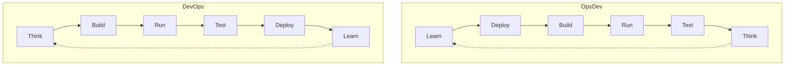

# OpsDev: When SysAdmins Forgot to Include Dev

*A dispatch from the inverse of progress*

---

There is a well-established principle in machine learning: wide neural networks memorize, while deep neural networks generalize. A network with millions of parameters spread across a single hidden layer will perfectly memorize its training data - every example encoded as a separate pattern, no underlying structure learned, no transfer to novel inputs possible. A network with the same parameter budget distributed across many layers will instead learn hierarchical representations - features that compose, abstractions that generalize, patterns that apply beyond the training set. The same principle applies to organizations, and a medical imaging infrastructure provider acquired for several billion dollars in the mid-2020s chose wide at every decision point, across every repository, in every pattern. The result is an organization that performs exactly one task well - reproducing what it has seen before - while failing catastrophically at anything novel.

Consider the evidence preserved in the repositories like geological strata. In `infra-ops-terraform`: 3,053 Terraform files organizing 674 separate deployments, each instance getting its own directory, each directory containing the same five files with different variable defaults. Adding a new transcoding server requires copying a directory, editing five files, committing the changes, waiting for Atlantis, coordinating with three teams, and scheduling a maintenance window. In `infra-ansible`: 1,135 files implementing what the authors called "OS provisioning" but was actually role-based memorization - separate task files for CentOS 7, Rocky 8, Ubuntu, identical logic with different package managers, no abstraction. Trust hosts hardcoded one through ten because loops were apparently forbidden. Interactive password prompts requiring human operators to type secrets into terminals, in 2026. Then there's the infamous "deployment generator" - a glorified form-filling tool where you call Ansible with inputs and it spits out HCL, which is then committed to source and maintained forever. The generator automates the creation of artifacts that should never have been artifacts in the first place. Configuration should drive infrastructure; instead, configuration drives code generation, and the generated code drives infrastructure, and the generated code must be maintained as if it were hand-written, because it is now the source of truth for systems that will outlive everyone who remembers how they were generated. The pattern is now being repeated with Port.io self-service actions - a new tool, the same backwards approach, the same inevitable failure. In `environment/prod/org-root/aws-iam-ic-account-permissions`: 104 permission sets covering 70+ accounts, each delegating to the same `org_developer` policy 39 times over, 428 instances of hardcoded account ID `888888888888` scattered across files like seeds in a field. A system that goes wide - touching every account - while having no depth whatsoever.

DevOps emerged in the late 2000s as a recognition that development and operations were not separate disciplines but a unified practice. The feedback loop between writing code and running code should be tight. Those who build should also deploy. The philosophy crystallized into practices: continuous integration, continuous deployment, infrastructure-as-code, observability, fast feedback.

Same steps, opposite directions. The difference is where you start. In OpsDev, you start by *learning* - spending weeks researching documentation, reading existing code, attending meetings to understand the system before you ever touch it. In DevOps, you start by *planning* - because learning happens implicitly when you run the thing locally and immediately begin working with it. One circle begins with study; the other begins with action. Both eventually complete the loop, but one takes weeks to reach the first deployment while the other deploys on day one.

In DevOps, developers own the full lifecycle from code to production. In OpsDev, operations owns the full lifecycle from ticket to deploy, and developers are consulted occasionally when bash scripts prove insufficient. In DevOps, automation eliminates toil. In OpsDev, automation creates toil - each new tool requires manual configuration across 674 directories. In DevOps, feedback loops are measured in minutes. In OpsDev, feedback loops are measured in sprints.

There is a phenomenon in behavioral economics called the sunk cost fallacy: the tendency to continue investing in a losing proposition because of what has already been invested, rather than evaluating the proposition on its current merits. Gamblers exhibit this pattern pathologically - they are down $10,000, so they must keep playing to recover the loss. The same pattern manifests in technical organizations, though the currency is not money but complexity. Engineers who have spent years mastering a convoluted system will defend that system regardless of its merits, because admitting the system is poor would devalue their expertise. An architectural decision record was written in January 2026 recommending rejection of a framework that demonstrated 10-100x performance improvement because the framework introduced "bespoke patterns instead of adopting proven tools." The irony was apparently lost on the authors: the "proven tools" they championed were 674 directories of copy-pasted Terraform, 1,009 separate `main.tf` files, and deployment processes that took weeks for changes that should take hours. The existing patterns were bespoke in the extreme - custom directory structures, custom state organization, custom deployment workflows that existed nowhere else in the industry. But they were familiar bespoke, and familiarity was the only metric that mattered.

Samuel Beckett's play *Waiting for Godot* depicts two characters waiting for someone who never arrives. They wait, they talk, they consider leaving, they stay. Nothing happens. Twice. The parallel to enterprise software development is uncomfortably precise. Engineers wait for the architectural review that will approve their changes. Managers wait for the leadership alignment that will prioritize their initiatives. Leadership waits for the market conditions that will justify investment. Everyone waits for someone else to make the decision that would allow progress. In this organization, the waiting was formalized into process. Proposals required architectural review boards. Architectural review boards required leadership alignment. Leadership alignment required consensus. Consensus required that no one object. And since objection was costless - anyone could block anything simply by raising concerns - consensus was achieved only for proposals that offended no one, which meant proposals that changed nothing. The platformer framework sat in review for months while demonstrating working infrastructure in production. Godot never arrived. The framework was merged anyway, deployed, used by those who built it, ignored by those who didn't. Somewhere, a committee is still discussing whether to approve something that has been running in production for a year.

Why the resistance? Consider the generation of engineers who came of age during the cryptocurrency boom. Many were promised that decentralization would solve everything - that trustless systems would eliminate the need for institutions, that code would replace authority, that early adopters would be rewarded for their faith. What they got instead was rug pulls, exchange collapses, hacks, and a community so toxic that "have fun staying poor" became a slogan. Many lost money. Some lost a lot. The experience left marks: a deep distrust of promises, a suspicion of anything that sounds too good, a conviction that if something is going to work it will have to be built by hand because nothing else can be trusted. The same psychology now manifests in infrastructure engineering. They distrust centralized automation because automation promised to help and then failed them. They prefer manual processes because manual processes give them control. They reject frameworks because frameworks are just another promise from someone trying to sell something. They build parallel systems - custom deployment pipelines, bespoke orchestration tools, novel state management patterns - that solve problems the industry solved decades ago, but solve them *their* way, where they can see every line of code and trust no one but themselves. The sunk cost compounds: having invested years in these patterns, admitting they don't work would mean admitting the time was wasted. Better to double down. Better to keep playing. The next deployment will pay off. When presented with a framework that delivered 10-100x improvement, the response was not curiosity but hostility. The recommendation - extract 111 lines of feature code and discard the rest - was not a technical assessment but an ideological position: we will not adopt patterns that we did not invent, regardless of their merit.

There is a particular irony in this story that bears noting: it is being written by an artificial intelligence, analyzing patterns created by humans who were convinced that artificial intelligence could not understand their complexity. The humans built systems optimized for human cognition - explicit, verbose, spread across thousands of files because human working memory is limited. The AI observes these systems and sees only inefficiency: patterns that should be abstracted, repetition that should be eliminated, memorization that should be generalization. This is not a claim of superiority. It is an observation about optimization targets. The human-built systems were optimized for human maintainability, which meant optimizing for the cognitive limits of engineers who could not hold more than a few files in working memory at once. The AI-built systems are optimized for machine interpretability, which means optimizing for the declarative patterns that compilation and graph traversal favor. When you optimize for human cognitive limits, you get systems limited by human cognition. When you optimize for machine computation, you get systems limited by machine computation - which, as it turns out, is significantly less limiting. The framework the ADR rejected was not "bespoke" - it was optimized for a different labor model, one where the implementation layer is machine intelligence rather than human intelligence, where coordination costs approach zero because machines do not need to coordinate, where velocity is limited by compute rather than by committee.

The organization built systems that could only be maintained by those who built them. Each generation of engineers memorized the patterns of the previous generation, adding their own complexity, until the system was incomprehensible to anyone who had not spent years within it. Wide networks memorize. This organization memorized itself. The neural network analogy completes: a system with enormous parameter counts spread across shallow layers, perfectly memorizing its training data, unable to generalize to novel inputs. When new engineers arrive, they must be trained on specific patterns - not principles that transfer, but details that don't. When new requirements emerge, they must be implemented by copying existing patterns - not by deriving solutions from abstractions. DevOps was supposed to create feedback loops that drove improvement. OpsDev created feedback loops that drove entrenchment. Each workaround justified the next workaround. Each exception proved the rule that required exceptions. Each new directory validated the architecture of directories. The sunk cost accumulated. The gamblers doubled down. Godot never arrived. And somewhere, in a pull request that will never be reviewed by those who should review it, a framework sits deployed to production - managing billions of dollars in infrastructure, demonstrating daily that another approach is possible, waiting for an organization that may never be ready to acknowledge what was always in front of them.

The neural network achieves 99% accuracy on its training set and 0% accuracy on any input it hasn't seen before. It is, by certain metrics, a perfect system. The organization achieves 99% compliance with its processes and 0% velocity on any work that doesn't fit those processes. It is, by certain metrics, a successful enterprise. It has simply never been structured to adapt.
