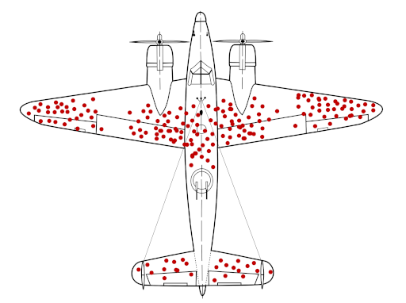

# Survivorship Bias: The Cost of Unopposed Consensus

## What Survivorship Bias Is

During World War II, the U.S. military studied aircraft returning from combat missions to determine where to add armor. The planes that came back had bullet holes concentrated in the fuselage, wings, and tail sections. The initial recommendation: reinforce those areas.

A statistician named Abraham Wald pointed out the error: they were only studying planes that survived. The bullet holes they could see marked the places where a plane *could* be hit and still make it home. The critical areas - the engine, the cockpit, the fuel tanks - weren't showing damage in their dataset because planes hit there didn't return. They were analyzing survivors and mistaking their wounds for vulnerabilities, when in fact those wounds proved resilience. The real vulnerabilities were invisible, present only in the planes that never made it back.

This is survivorship bias: drawing conclusions from an incomplete dataset because the missing data points are no longer observable.

## How This Manifests Here

This organization has grown through continuous acquisitions over 15+ years, culminating in a $2.3 billion acquisition by GE Healthcare. The company is now led and staffed predominantly by "lifers" - employees with 10, 15, 20+ years of tenure who have spent their entire careers here. These are the survivors. What's not visible is everyone who left.

Consider what we cannot measure:
- **The engineers who saw problems and departed after 6 months**
- **The architects who proposed alternatives and were dismissed**
- **The technical leads who questioned patterns and found no audience**
- **The operators who implemented better practices at previous companies and couldn't gain traction here**
- **The managers who tried to introduce industry-standard methodologies and faced resistance**

Each person who left took with them: their perspective, their experience from other organizations, their knowledge of industry practices, their questions about why things work this way, their challenges to established patterns. What remains is a group of people who, by definition, found the environment acceptable enough to stay. And in the absence of outside perspectives, they've developed consensus around practices that may not survive external scrutiny.

## The Echo Chamber Effect

The surviving group creates a self-reinforcing feedback loop. When everyone in the room has 15+ years of tenure at the same organization, there's no reference point for comparison. Practices that emerged organically during growth become "the way we do things." Patterns that worked at smaller scale become doctrine at larger scale. Technical decisions made pragmatically in 2010 become unquestioned foundations in 2025.

This manifests in specific, observable ways:

**"DevOps" as implemented here is 10x slower than manual UI operations.** That's not what DevOps means in the broader industry, but there's no one left in the room who has recent experience with actual high-velocity DevOps environments to provide that perspective. The label is applied, the practices are considered DevOps, and consensus forms around this definition.

**Infrastructure patterns that worked for 20 accounts have been scaled to 127 accounts without fundamental rearchitecture.** The pain points are evident - 4-week timelines for changes that should take days, drift that goes undetected for months, patch management non-functional for over a year. But there's no external perspective saying "this is not how other organizations handle this scale." The survivors compare only against their own history: it's harder now than before, but that's just the nature of growth.

**Challenges to established patterns are met with territorial defense rather than technical discussion.** New employees who propose alternatives are told "that's not how we do it here" or "respect the chain of command." This isn't malicious - it's self-protective. If the new approach is better, what does that imply about the years spent building the current approach? Easier to dismiss the challenge than interrogate the implications.

**The culture optimizes for tenure over competence.** "I've been here longer, so I have authority" becomes the basis for technical decisions. Proposals are judged by who made them, not by their technical merit. This is survivorship bias in action: the people who stayed are assumed to have the deepest knowledge, when in reality they may have the *narrowest* knowledge - deep expertise in one organization's patterns, but no exposure to how the rest of the industry evolved.

## The Consequences: Organizational and Individual

There are two levels of concern here: organizational health and individual employability.

**Organizationally:** This company manages critical healthcare infrastructure for 40+ production tenants across 127 AWS accounts, with exposure expanding to 160+ countries through GE Healthcare. The infrastructure patterns documented elsewhere in this directory - non-functional patch management for 12+ months, security controls that aren't validated, deployment processes that take weeks for changes that should take hours - these are not theoretical problems. They represent strategic risk. When competitors can respond to security vulnerabilities in hours while this organization requires weeks of coordination, that's a competitive vulnerability. When infrastructure is fragile enough that rebuilding from disaster requires months rather than days, that's operational risk.

The survivors built a $2.3 billion house of cards. That's not an indictment - it's an observation. The value is real. The acquisition happened. But the structure is fragile because it was built without outside perspective challenging assumptions, without architectural evolution, without the kind of productive conflict that comes from diverse viewpoints. GE Healthcare's due diligence may have valued the tenant base and revenue, but the technical debt and operational fragility represent hidden costs that will eventually manifest.

**Individually:** The engineers, architects, and operators who have spent their entire careers in this environment have developed expertise that may not transfer to other organizations. The patterns that dominate here - artifacts-based infrastructure, deploy-once workflows, Scrum ceremonies without DevOps substance, security theater instead of verification - these are not industry-standard practices. An engineer who has built their expertise around "the normal way" at the company may discover that "normal" means something very different at their next employer.

This is not a judgment on individual competence. It's an observation about context. Fifteen years at one organization, no matter how successful, creates expertise that is deep but narrow. Without exposure to how other companies handle similar challenges, without experience with modern tooling and practices, without the forcing function of having to adapt to different organizational cultures and technical stacks, that expertise becomes increasingly specific and less transferable.

We have an obligation to our employees to ensure they're developing skills that will serve them throughout their careers, not just within this organization. When the culture makes people *less* employable rather than more, that's a problem.

## Why This Matters Now

The comfortable consensus is breaking. New employees arrive with experience from other organizations and immediately see patterns that don't align with industry standards. The GE Healthcare acquisition brings exposure to global scale and enterprise standards that may not tolerate the fragility documented throughout this analysis. Tenant expectations evolve - the infrastructure patterns that worked in 2015 don't meet the reliability and security requirements of 2025.

More fundamentally: the technical debt is compounding faster than it can be addressed within current patterns. When patch management is non-functional for over a year and no one notices until explicit validation is performed, that reveals a systemic failure of accountability. When security controls exist on paper but not in practice, that's not just a technical gap - it's a cultural gap. When alternatives are dismissed without evaluation, that's not confidence - it's fragility.

The survivors have each other's validation, but they no longer have the full dataset. Every person who left took perspectives that aren't replaceable through internal consensus. The only way to recover those missing perspectives is to **actively seek external validation**: hire people with diverse backgrounds and actually listen to them, benchmark practices against industry standards rather than internal history, bring in outside consultants specifically to challenge assumptions, create psychological safety for technical dissent even when it's uncomfortable.

## A Path Forward: Intentional Discomfort

The solution is not to dismiss the survivors or discard institutional knowledge. Fifteen years of experience managing healthcare infrastructure at scale is valuable. The tenant relationships, the domain expertise, the operational knowledge - that's irreplaceable.

What's needed is intentional injection of external perspectives:

**Hire for diversity of experience, not culture fit.** Bring in people who have worked at organizations that actually practice DevOps, who have operated infrastructure at larger scale, who come from companies with mature engineering cultures. Then create space for their perspectives to be heard without dismissing them as "not understanding how we do things."

**Implement external benchmarking.** Measure deployment velocity, incident response times, patch compliance rates against industry standards. Not to shame the team, but to establish whether internal consensus aligns with external reality.

**Mandate technical review by outside experts.** Bring in consultants specifically to evaluate infrastructure patterns and provide brutally honest assessment. Pay them for honesty, not validation.

**Create accountability for outcomes, not just activity.** If patch management has been non-functional for 12+ months, that represents a failure of oversight. Someone should have noticed. Someone should have validated. The fact that no one did reveals that accountability is based on activity (we deployed the infrastructure) rather than outcomes (the infrastructure actually works).

**Acknowledge that comfort is not the same as correctness.** The patterns are comfortable because they're familiar. The consensus is strong because everyone remaining has accepted these patterns. But comfort and consensus don't equal correctness. If the organization can't tolerate uncomfortable questions and challenging alternatives, it will continue optimizing locally while the industry moves past it.

## The Stakes

This is not about being mean to people who have dedicated their careers to this organization. This is about recognizing that survivorship bias is a statistical phenomenon, not a personal failing. The people who stayed aren't less capable - they're just operating with an incomplete dataset that excludes every perspective that left.

But incomplete datasets produce incomplete conclusions. And at this scale, with these stakes, incomplete conclusions create risk: risk to tenants whose healthcare infrastructure depends on our reliability, risk to the organization whose technical debt is compounding, and risk to individual employees whose expertise may not prepare them for their next role.

The question is whether the organization can recognize the problem and intentionally correct for it, or whether external forces - tenant demands, GE Healthcare standards, competitive pressure, security incidents - will eventually force the correction.

The choice is whether to address survivorship bias proactively, or to wait until the planes that didn't make it back start showing up in the failure data.
