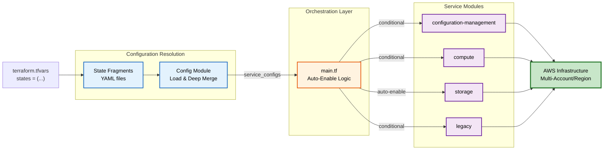

## Platformer

**Self-Service Infrastructure Framework**

This diagram shows how Platformer orchestrates infrastructure from state fragments through to AWS deployment. Configuration flows through a config module, an orchestration layer makes conditional decisions about which modules to enable, and service modules are rendered into AWS infrastructure deployments.

---

### GitOps-Based Account-Level Infrastructure Management for AWS

Key Characteristics of This Framework:

- State Fragments → Config Module → Orchestration → Services → AWS
- Dependency Inversion: Modules Auto-Enable When Needed
- Pattern-Based Multi-Account Targeting via `top.yaml`
