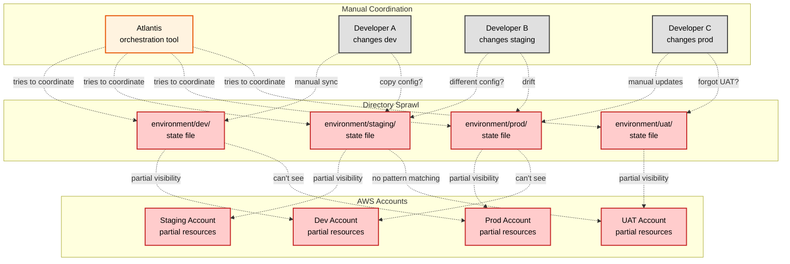

## The Problem: Fragmented State

The legacy approach uses separate directory structures and state files for each environment. This diagram illustrates the chaos that results: developers working independently with no coordination, Atlantis attempting to orchestrate across fragmented states, and each environment having only partial visibility into other accounts. Notice the abundance of dotted lines showing uncertainty and manual coordination efforts.

---

### The Legacy Approach Creates Multiple Pain Points:

- Each State File Operates in Isolation - No Organizational Context
- Manual Coordination Across Environments Leads to Drift
- No Pattern Matching - Explicit Management of Every Environment
- Orchestration Tools Needed Just to Keep Things Synchronized
