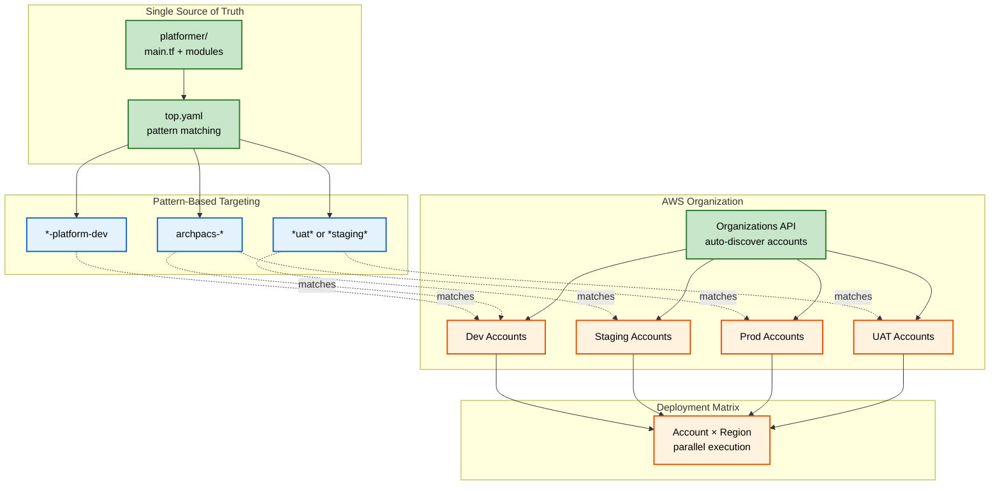

## The Solution: One State

This diagram shows how a single codebase with pattern matching replaces the fragmented approach. Pattern expressions like `*-platform-dev` automatically match multiple accounts discovered via the AWS Organizations API. Every deployment converges toward the same state—one unified configuration manifest where services are conditionally enabled based on composed state fragments. The deployment matrix generates parallel executions across matched accounts and regions, eliminating the need for manual coordination.

---

### How It Solves the Problems:

- **One Codebase:** Single state per account/region - no directory sprawl
- **Pattern Matching:** `*-platform-dev` targets all platform dev accounts automatically
- **Full Visibility:** Every deployment knows about the entire organization via AWS Organizations API
- **No Manual Coordination:** GitHub Actions generates deployment matrix automatically
