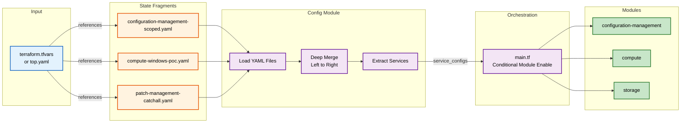

## Configuration Flow

This diagram traces how configuration moves through the system, from the initial configuration file listing state fragments, through the loading and merging process, to the final conditional enablement of service modules. Follow the colored boxes to see how YAML state files (orange) are loaded and merged (purple), then used by main.tf to conditionally enable service modules (green).



---

### About "State" (Disambiguation)

The term "state" here follows Salt and broader IaC conventions:

- ❌ **Not Terraform State:** These are not `.tfstate` backend files tracking actual resources
- ✅ **Desired State:** Configuration fragments describing how infrastructure should be configured

---

### State Fragment Examples

State fragments are minimal YAML files that override defaults. Most contain just a few properties.

**compute-windows-poc.yaml:**
```yaml
services:
  compute:
    windows-poc:
      ami_filter: "Windows_Server-2022-English-Full-Base-*"
      instance_type: "t3.medium"
      count: 1
```

**configuration-management-scoped.yaml:**
```yaml
services:
  configuration-management:
    schedule_expression: "rate(30 minutes)"
    max_concurrency: "10%"
    compliance_severity: "HIGH"
```

Each fragment defines only what differs from the module's defaults - everything else is inherited.

---

### Local Development Configuration

**terraform.tfvars** - Used when running Terraform locally:
```hcl
states = [
  "configuration-management-scoped",
  "compute-windows-poc",
  "patch-management-catchall"
]
```

Developers load state fragments directly for testing in a single account/region.

---

### Production Configuration

**top.yaml** - Used by CI/CD for multi-account deployments:
```yaml
targets:
  '*-platform-dev':
    - regions-east
    - configuration-management-scoped
    - compute-windows-poc

  '*uat* or *staging*':
    - regions-most
    - configuration-management-monthly
    - patch-management-catchall

  'example-account-2':
    - regions-most
    - configuration-management-monthly
    - patch-management-catchall
```

Pattern matching automatically targets multiple accounts. Each matched account loads the same state fragments.

---

### Composable Configuration:

- **State Fragments:** Reusable YAML files defining services
- **Deep Merge:** Later states override earlier ones (left-to-right precedence)
- **Conditional Enable:** Modules only created when referenced in loaded states
- **Same Code Everywhere:** Dev and prod use identical Terraform - only state fragments differ
- **Two Entry Points:** Local uses terraform.tfvars, CI/CD uses top.yaml - both reference the same state fragments
