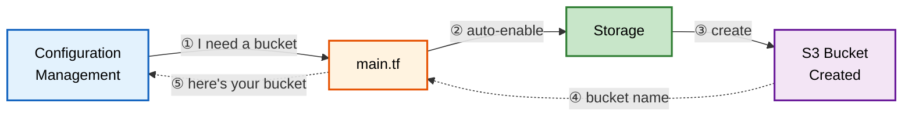

## Innovation: Dependency Inversion

This diagram shows a single example of dependency inversion in action. Follow the numbered steps: configuration-management declares it needs a bucket, main.tf detects this need and auto-enables storage, storage creates the bucket, and finally the bucket name loops back to configuration-management. Notice that configuration-management never directly references the storage module.

---

### Key Benefit:

**Traditional Approach:**
- configuration-management must know about storage module
- Tight coupling between modules
- Hard to test in isolation

**Inverted Dependencies:**
- configuration-management declares "I need a bucket"
- main.tf detects need and enables storage automatically
- Modules remain decoupled and testable
- No explicit `storage: {}` configuration required

**Further Reading:**

This pattern extends dependency injection principles to Terraform module composition. Rather than modules instantiating their dependencies directly, they declare needs through interfaces, and the orchestrator injects providers automatically.

https://en.wikipedia.org/wiki/Dependency_injection

https://developer.hashicorp.com/platformer/language/modules/develop/composition
