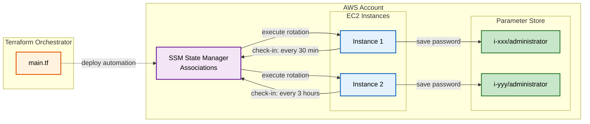

## Password Rotation Flow

This diagram shows how instances self-manage their password rotations within the same AWS account. Our orchestrator deploys the SSM State Manager association, which triggers instances to execute password rotation scripts on themselves every 30 minutes. Each instance then saves its new password directly to Parameter Store in the same account. No cross-account secrets management required.

---

### Self-Managed Infrastructure:

Instances execute rotation scripts on themselves and save passwords locally to Parameter Store - all within the same AWS account. Terraform manages the complete lifecycle: deploy association, rotate passwords, destroy cleanly.
