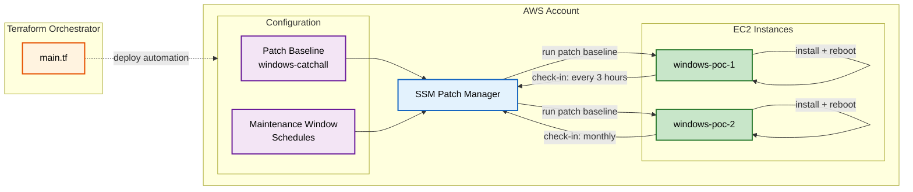

## Patch Management Flow

This diagram shows how patch management works similarly to password rotation, with instances checking in on their maintenance window schedules. The patch baseline defines which patches are approved, the maintenance window controls when instances check in, and SSM orchestrates the patching process. Notice how different instance classes can have different schedules.

---

### Class-Based Targeting:

Namespace isolation ensures multi-developer and multi-environment deployments don't cross-contaminate in shared AWS accounts. Each instance class can have different patch schedules and baselines.

### Pattern-Based Targeting:

Maintenance windows and patch baselines support wildcard and pattern-matched targeting for managing instances outside of Terraform's control. Use patterns like `*-windows-*` to match multiple classes, or `*` to target all instances in an account. This enables patch management of existing infrastructure that wasn't deployed by this framework, without requiring explicit enumeration of instance classes.
