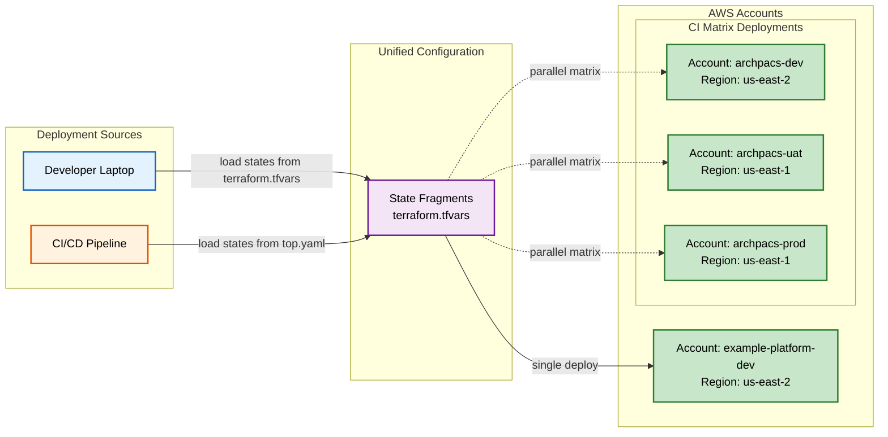

## Developer Experience

This diagram shows two deployment paths that use the same configuration approach. A developer on their laptop deploys to a single account/region for testing, while CI/CD reads top.yaml to generate a matrix and deploys to multiple accounts simultaneously. Both use identical state fragments - the only difference is the deployment scope.

---

### Dev/Prod Parity:

Same code, same state fragments - developers test locally with a single account, CI/CD deploys to multiple accounts via matrix. The configuration approach is unified regardless of deployment source.
