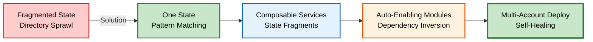

## Platformer

This final diagram shows the transformation journey: from the fragmented state problem (red), through the one state solution (green), to composable services (blue), auto-enabling modules (orange), and finally to multi-account self-healing deployment (bold green). Each stage builds on the previous capability.

---

### Making Infrastructure as Composable as Modern Applications

From fragmented, per-environment directories to composable, pattern-matched, self-healing infrastructure deployed across the entire AWS organization.

---

### Acknowledgments

This work builds directly on the systems, processes, and organizational foundation established by our team. The existing infrastructure and operational practices provided the stable environment necessary to explore new architectural approaches. Every innovation shown here stands on the shoulders of the work that came before it - from our CI/CD pipelines to our AWS account structure to our established patterns for infrastructure management. This represents a collective evolution of our platform capabilities, made possible by the team's ongoing commitment to operational excellence and continuous improvement.
